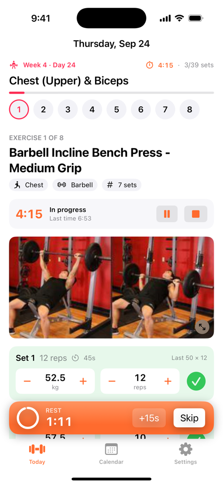
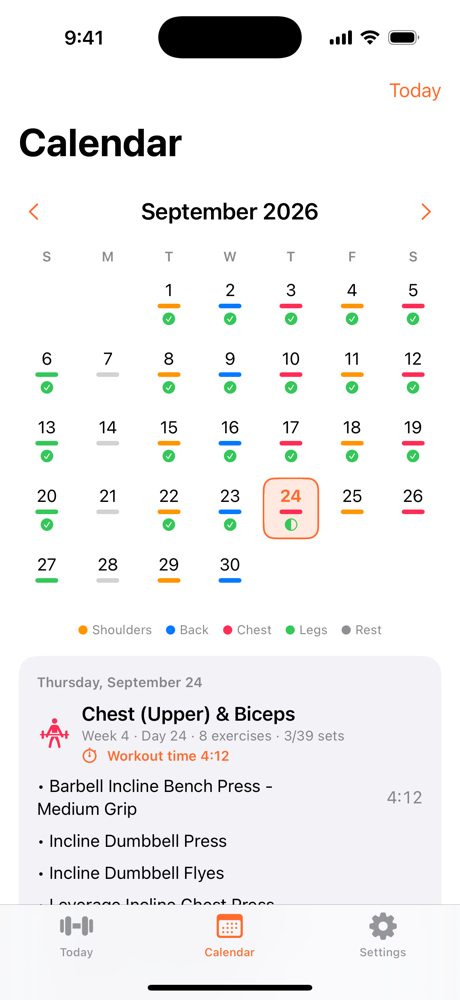
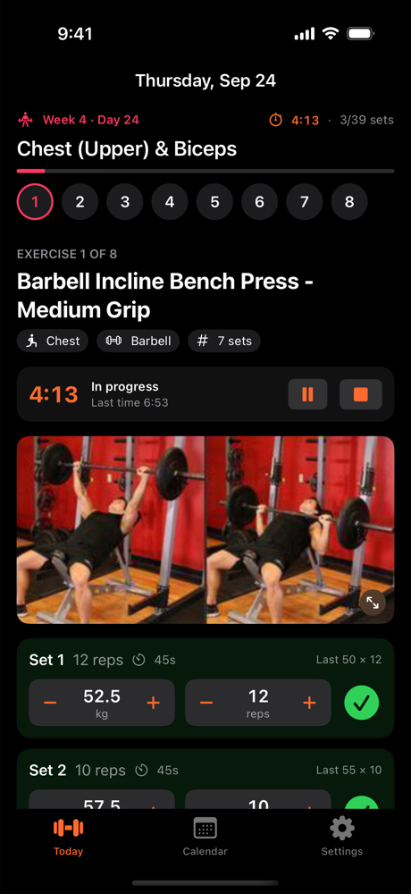
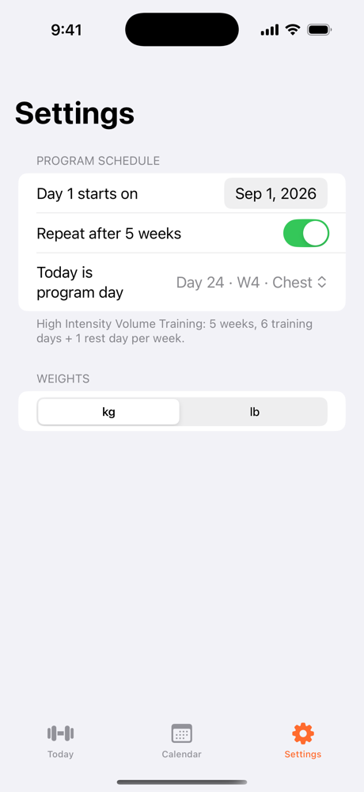

# Trainer

An iPhone workout logger for the 5-week **High Intensity Volume Training (H.I.V.T.)** program. Open the app at the gym and it shows today's workout. Swipe through the exercises and tap a set to log it. The rest timer starts on its own.

<p align="center">
  
  
  
  
</p>

## Features

- **Today's workout.** The app maps the current date to a program day: a workout, a rest day, or a date outside the program. Swipe between exercises, or jump to one from the numbered strip. The header tracks sets done and total workout time.
- **Quick set logging.** Each set and drop set has weight and rep steppers and a big check button. Weights are prefilled from the set above or from your last session. The "Last 50 × 12" hint shows what you did last time.
- **Rest timer.** Checking a set starts that set's rest countdown, with +15s and Skip buttons. A local notification fires when rest ends, even if the phone is locked or you're in another app. If you tick several sets within 10 seconds (catching up on logging), the countdown keeps running instead of restarting each time.
- **Exercise timers.** A per-exercise stopwatch starts when you log the first set and stops after the last one. You can also pause, resume, or reset it manually. Only one exercise timer runs at a time.
- **Calories.** Each exercise shows a running calorie estimate while you work, and the header shows the day's total. When you finish an exercise, a banner shows its time and calories. When you finish the whole workout, it shows the workout's total. If you wear an Apple Watch, the app uses the active calories the Watch recorded during the exercise. Otherwise it estimates them with the formula below, using your latest body weight (from the Body tab or Apple Health; 75 kg until you log one). The Calendar shows calories per exercise and per day.
- **Reference photos and coach tips.** Every exercise has a start and end photo (tap to view full screen, pinch to zoom). The program's coaching notes are collapsed until you tap them.
- **Calendar.** Days are color-coded by muscle group, with markers for completed and partial workouts. Tap a day to see its exercises, per-exercise times, and total workout time, or to open that day's workout.
- **Body tracking.** Log body weight and tape measurements (waist, chest, arms, hips, thighs) with any mix of fields. Charts show the weight trend over the last 90 days and each measurement over time. Drag across a chart to read exact values. Tap a check-in to edit it, or swipe to delete it.
- **Apple Health.** Connect from the Body tab to show daily steps (today plus a 7-day chart) and your Apple Health weigh-ins on the weight chart. It also reads Apple Watch active energy for the calorie counts. Access is read-only.
- **Extra sets.** Add sets beyond the plan; long-press an extra set to delete it.
- **Customizable program.** In the **Workouts** tab you can rename workouts, and add, remove or reorder their exercises. You can also change each exercise's sets, targets, rest times and drop sets for that workout. Each workout repeats on its scheduled days, so an edit applies to every week. The exercise library lets you edit or create exercises: name, muscle, equipment, photos or screenshots, tags, coach tip, default rest, and default sets. **Reset to default program** restores the original H.I.V.T. workouts and keeps your custom exercises and history.
- **iCloud sync.** Workouts, exercises (including photos), set logs, timers and body check-ins are stored in your private iCloud database. They come back when you reinstall or sign in on another iPhone. Without an iCloud account, everything stays on the device.
- **Settings** (gear icon, top right). Choose the Day 1 start date or pick which program day today is. Choose whether the 5-week cycle repeats, and whether to use lb and inches (the default) or kg and centimetres.
- The app's name is shown at the top of the Today screen. It supports light and dark mode, and the screen stays awake during a workout.

## The program

The default program comes from the H.I.V.T. PDF and is bundled as [`Trainer/Resources/program.json`](Trainer/Resources/program.json). On first launch it's copied into the app's database, where it can be edited and is synced through iCloud. It runs 35 days (5 weeks), with 6 training days and 1 rest day each week. The split is:

| Day | Workout |
| --- | --- |
| 1 | Shoulder (Push Emphasis) & Triceps |
| 2 | Back (Width / Thickness Emphasis) |
| 3 | Chest (Upper) & Biceps |
| 4 | Shoulder (Pull Emphasis) & Triceps |
| 5 | Chest (Mid/Lower) & Biceps |
| 6 | Legs (Quad / Hamstring Emphasis) |
| 7 | Rest |

Each exercise lists its muscle group, equipment, optional tip, reference image, and its sets. A set has a target (such as `"10 to 12 reps"` or `"To failure"`), the rest time in seconds, and any drop sets:

```json
{
  "name": "Seated Dumbbell Press",
  "muscle": "Shoulders",
  "equipment": "Dumbbell",
  "tip": null,
  "sets": [
    { "kind": "Standard", "target": "12 reps", "rest": 45, "drops": [] }
  ],
  "image": "ex-seated-dumbbell-press"
}
```

Edit this file to change the *default* program that new installs start with. Users customize their own copy in the app. Images are looked up by name in `Trainer/Resources/ExercisePhotos/`.

## How calories are estimated

Without Apple Watch data, the app uses the standard formula from the Compendium of Physical Activities. It subtracts resting energy, so the result is *active* calories, the same measure Apple Health uses:

```
active kcal = (MET − 1) × 3.5 × body weight (kg) ÷ 200 × minutes
```

| Exercise | MET |
| --- | --- |
| Strength training (default) | 5.0 |
| Has a drop set or a set to failure | 6.0 |
| Abdominals | 3.8 |

Minutes come from the exercise timer, so time spent paused doesn't count. When an exercise finishes, its estimate is saved. If Apple Watch active energy exists for that time window, the Watch value replaces the estimate. Watch data can reach the phone a few minutes late, so the app checks again when you reopen the workout or the Calendar day. Only samples from an Apple Watch count. iPhone motion data barely registers weight training. Either way it's an estimate: calories from strength training vary a lot between people.

## Requirements

- Xcode 16 or later
- iOS 17.0 or later (iPhone only)
- No third-party dependencies. The app uses SwiftUI, SwiftData with CloudKit, Swift Charts, HealthKit, PhotosUI, and UserNotifications.
- iCloud sync needs a paid Apple Developer Program membership. Personal (free) teams can't sign an app that has the iCloud capability. To build with a free team, remove the iCloud and push entries from `Config/Trainer.entitlements`. The app then falls back to on-device storage.

## Getting started

1. Open `Trainer.xcodeproj` in Xcode.
2. Select the **Trainer** scheme and an iPhone simulator or device.
3. Build and run (⌘R).

On first launch, the program starts today. Allow notifications so the rest timer can alert you. To run on a physical device, set your own signing team in **Signing & Capabilities**. The HealthKit, iCloud (CloudKit container `iCloud.com.naveenkeerthy.Trainer`), and push capabilities are set in `Config/Trainer.entitlements`. Before the first App Store release, deploy the CloudKit schema to production in the [CloudKit Console](https://icloud.developer.apple.com/). To change Health access later, open the Settings app and go to **Health → Data Access & Devices → Trainer**.

## Project structure

```
Trainer/
├── TrainerApp.swift          # App entry, iCloud-backed model container, tab bar
├── Models/
│   ├── Program.swift         # Set schemes, workout snapshot types, schedule → program-day mapping
│   ├── ProgramModels.swift   # SwiftData: Exercise, ExercisePhoto, Workout, WorkoutItem
│   ├── ProgramSeeder.swift   # Default program, iCloud de-duplication, log migration, reset
│   ├── SetLog.swift          # SwiftData: one logged set/drop per date
│   ├── ExerciseTiming.swift  # SwiftData: per-exercise stopwatch + timing rules
│   ├── BodyEntry.swift       # SwiftData: body weight + measurements, unit conversion
│   ├── HealthManager.swift   # Read-only HealthKit: weight, daily steps, Apple Watch active energy
│   ├── Calories.swift        # MET formula, body-weight lookup, Watch-data override
│   └── RestTimer.swift       # Rest countdown + local notification
├── Views/
│   ├── WorkoutDayView.swift  # Today tab, rest-day view, swipeable workout pager
│   ├── ExercisePage.swift    # One exercise: timer, photos, tags, tip, set rows
│   ├── PhotoCarousel.swift   # Swipeable exercise photos + full-screen viewer
│   ├── SetRow.swift          # Weight/reps steppers + done button
│   ├── RestTimerBanner.swift # Floating rest countdown
│   ├── CalendarScreen.swift  # Month grid + selected-day summary
│   ├── BodyView.swift        # Body tab: Health steps, weight + measurement charts, history
│   ├── BodyEntrySheet.swift  # Log/edit a body check-in
│   ├── SettingsView.swift    # Settings sheet (gear button): start date, repeat, units, iCloud
│   └── Program/              # Workouts tab
│       ├── ProgramView.swift         # Workout list + exercise library
│       ├── WorkoutEditorView.swift   # Edit a workout, its per-workout sets, exercise picker
│       ├── ExerciseEditorView.swift  # Create/edit an exercise: photos, tags, tip, defaults
│       └── SetsEditor.swift          # Targets, rest and drop sets
└── Resources/
    ├── program.json          # The 5-week program
    └── ExercisePhotos/       # Start/end reference photos
Config/
├── Trainer.entitlements      # HealthKit, iCloud (CloudKit), push
└── Info.plist                # Background remote notifications for iCloud sync
Scripts/
└── make-icon.swift           # Generates the app icon variants
```

The program, workout history and body check-ins are stored with SwiftData and mirrored to the user's private iCloud database. Body values are stored in kg and cm. The app converts them to your chosen unit for display. Settings are kept in `UserDefaults`. Apple Health data is read when needed and never copied into the app's database.

## Future plans

- **3D animated exercise demos.** Replace the static start/end photos with a 3D animated figure performing each exercise. Show it from any angle, loop it at full or slow speed, and highlight the muscles it works, so correct form is easier to understand than it is from two photos.
